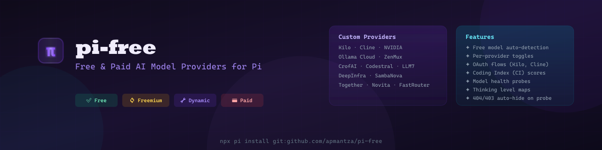

# pi-free-providers

<p align="center">
  
</p>

Free and paid AI model providers for [Pi](https://pi.dev). Access **free and paid models** from multiple providers in one install.

---

## What does pi-free do

**pi-free is a Pi extension that unlocks free and paid AI models from multiple providers.**

When you install pi-free, it:

1. **Registers free-tier providers** with Pi's model picker — Kilo (free), Cline (free), NVIDIA (freemium), ZenMux (paid), CrofAI (paid), Ollama Cloud (freemium), and more

2. **Fetches models dynamically** from provider APIs — NVIDIA NIM, ZenMux, CrofAI, and Pi's built-in providers (Mistral, Groq, Cerebras, xAI, Hugging Face, OpenRouter) when API keys are configured

3. **Filters to show only free models by default** for providers that expose pricing — You see only the models that cost $0 to use. Paid models are hidden until you explicitly toggle them on.

4. **Provides per-provider toggle commands** — Run `/toggle-{provider}` (e.g., `/toggle-kilo`) to switch between free-only mode and showing all models including paid ones. Changes apply immediately and your preference is saved for the next Pi restart.

5. **Handles authentication for you** — OAuth flows (Kilo, Cline) open your browser automatically; API keys are read from `~/.pi/free.json` or environment variables

6. **Adds Coding Index scores** — Model names include a coding benchmark score (CI: 45.2) to help you pick capable coding models at a glance

7. **Persists your preferences** — Your toggle choices (free vs all models) are saved to `~/.pi/free.json` and remembered across Pi restarts

---

## How to use

### 1. Install the extension

```bash
pi install git:github.com/apmantza/pi-free
```

### 2. Open the model picker

Start Pi and press `Ctrl+L` to open the model picker.

Free models are shown by default — look for the provider prefixes:

**✅ Free Models (no payment required):**

- `kilo/` — Kilo models (free models available immediately, more after `/login kilo`)
- `openrouter/` — OpenRouter models (free account required)
- `cline/` — Cline models (run `/login cline` to use)
- `llm7/` — LLM7 gateway models (free tier: default/fast selectors, 100 req/hr)

**🔄 Freemium (free tier with limits, then paid):**

- `nvidia/` — NVIDIA NIM models (1,000 free requests/month, then credits)
- `ollama-cloud/` — Ollama Cloud models (usage-based free tier, resets every 5 hours + 7 days)
- `sambanova/` — SambaNova Cloud models (20-480 RPM free, no credit card required)

**💳 Paid Providers (API key with credits required):**

- `zenmux/` — ZenMux AI gateway (200+ models from OpenAI, Anthropic, Google, etc.)
- `crofai/` — CrofAI OpenAI-compatible API (streaming, reasoning models)
- `codestral/` — Codestral via Mistral (free Experiment plan: 2 req/min, 1B tokens/month)
- `deepinfra/` — DeepInfra inference cloud ($5 one-time trial credit, no credit card)
- `novita/` — Novita AI (100+ open-source models, OpenAI-compatible, 3 free models)
- `routeway/` — Routeway AI gateway (OpenAI-compatible, `:free` models)

> **Note:** Paid providers may occasionally offer free models or promotional credits. The `isFreeModel` helper automatically detects free models based on provider pricing data or model names containing "free". For providers that don't expose pricing (like CrofAI), only models with "free" in their names are marked as free.

**🔧 Dynamic API Providers (fetched when API key configured):**

- `mistral/` — Mistral models (when `MISTRAL_API_KEY` set)
- `groq/` — Groq models (when `GROQ_API_KEY` set)
- `cerebras/` — Cerebras models (when `CEREBRAS_API_KEY` set)
- `xai/` — xAI models (when `XAI_API_KEY` set)
- `huggingface/` — Hugging Face models (when `HF_TOKEN` set)
- `openrouter/` — OpenRouter models (fetched from openrouter.ai, when `OPENROUTER_API_KEY` set)
- `fastrouter/` — FastRouter models (always discovered, 170+ models, no auth for listing)

**Note:** Fireworks is now a [built-in Pi provider](https://github.com/badlogic/pi-mono/blob/main/packages/coding-agent/CHANGELOG.md#0681---2026-04-22) — no extension needed. Set `FIREWORKS_API_KEY` to use it directly.

### 3. Toggle between free and paid models

Want to see paid models too? Run the toggle command for your provider:

```
/toggle-kilo       # Toggle Kilo (✅ offers free models)
/toggle-openrouter # Toggle OpenRouter (✅ offers free models)
/toggle-cline      # Toggle Cline (✅ offers free models)
/toggle-nvidia     # Toggle NVIDIA (🔄 freemium)
/toggle-ollama     # Toggle Ollama Cloud (🔄 freemium)
/toggle-mistral    # Toggle Mistral (🔧 dynamic - needs API key)
/toggle-groq       # Toggle Groq (🔧 dynamic - needs API key)
/toggle-cerebras   # Toggle Cerebras (🔧 dynamic - needs API key)
/toggle-xai        # Toggle xAI (🔧 dynamic - needs API key)
/toggle-huggingface # Toggle Hugging Face (🔧 dynamic - needs HF_TOKEN)
/toggle-zenmux    # Toggle ZenMux (💳 paid - needs API key with credits)
/toggle-crofai    # Toggle CrofAI (💳 paid - needs API key with credits)
/toggle-codestral # Toggle Codestral (💳 paid - free Experiment plan)
/toggle-deepinfra # Toggle DeepInfra (💳 trial credit provider)
/toggle-together  # Toggle Together AI (💳 trial credit provider)
/toggle-sambanova # Toggle SambaNova (🔄 freemium)
/toggle-llm7      # Toggle LLM7 (✅ free gateway)
/toggle-novita    # Toggle Novita AI (💳 paid — 3 free models)
/toggle-routeway  # Toggle Routeway AI (💳 paid — has :free models)
/toggle-fastrouter # Toggle FastRouter (🔧 dynamic — always discovered)
```

**Notes:**

- **Toggle commands are mainly for ✅ and 🔄 providers** — to switch between "free models only" vs "show paid models too"
- **🔧 Dynamic providers** show all fetched models by default — the toggle filters the list when you have an API key configured
- **Freemium providers** show all models by default; you manage your usage limits via their dashboards

### 4. Add API keys for more providers (optional)

Some providers require a free account or API key.

**The first time you run Pi after installing this extension, a config file is automatically created:**

- **Linux/Mac:** `~/.pi/free.json`
- **Windows:** `%USERPROFILE%\.pi\free.json`

Add your API keys to this file:

```json
{
  "nvidia_api_key": "nvapi-...",
  "ollama_api_key": "...",
  "mistral_api_key": "...",
  "codestral_api_key": "...",
  "deepinfra_api_key": "...",
  "sambanova_api_key": "...",
  "llm7_api_key": "...",
  "zenmux_api_key": "...",
  "crofai_api_key": "...",
  "routeway_api_key": "sk-..."
}
```

Or set environment variables instead (same names, uppercase: `OPENROUTER_API_KEY`, `NVIDIA_API_KEY`, etc.)

If `~/.pi/free.json` contains invalid JSON, pi-free now logs the parse error to `~/.pi/free.log` so you can fix the file quickly.

See the [Providers That Need Authentication](#providers-that-need-authentication) section below for detailed setup instructions per provider.

### 5. Quick commands reference

| Command              | What it does                                              |
| -------------------- | --------------------------------------------------------- |
| `/toggle-{provider}` | Switch between free-only and all models for that provider |
| `/toggle-free`       | Toggle global free-only mode for ALL providers            |
| `/free-providers`    | Show free/paid model counts for all providers             |
| `/login kilo`        | Start OAuth flow for Kilo                                 |
| `/login cline`       | Start OAuth flow for Cline                                |
| `/logout kilo`       | Clear Kilo OAuth credentials                              |
| `/logout cline`      | Clear Cline OAuth credentials                             |

---

## Features

### 🔍 NVIDIA: Pre-Filtering + 404 Detection

NVIDIA's API lists 130+ models, but 57+ return 404 "Function not found" when you try to use them. pi-free solves this:

- **57 known 404s hard-filtered** — Discontinued models (`dbrx-instruct`, `codellama-70b`), embedding models mislabeled as chat-capable (`nv-embed-*`), and stale catalog entries are silently excluded
- **Auto-discovery from NVIDIA's API** — Queries `integrate.api.nvidia.com/v1/models` directly for the ground-truth list
- **`/probe-nvidia` command** — On-demand health check: tests every model with a minimal request, auto-hides new 404s, and re-registers immediately

### 🎯 Coding Index (CI) Scores

Every model shows a **Coding Index score** (e.g., `CI: 52.3`) in the model picker:

- **Benchmark-based** — Scores derived from Artificial Analysis coding benchmarks (HumanEval, MBPP, etc.)
- **Quality indicator** — Higher scores = better coding performance
- **All providers** — Applied to every model from every provider (NVIDIA, Mistral, Groq, etc.)

**Missing CI scores?** Provider model IDs often don't match benchmark database keys exactly. pi-free applies provider-specific normalization to improve matching:

| Provider     | Normalization Applied                                              |
| ------------ | ------------------------------------------------------------------ |
| **NVIDIA**   | Strips vendor prefixes (`meta/`, `mistralai/`, `microsoft/`, etc.) |
| **Groq**     | Removes `-versatile` and numeric suffixes (`-32768`)               |
| **Cerebras** | Normalizes `llama3.1` → `llama-3.1`, adds `instruct` suffix        |
| **Mistral**  | Strips `-latest` suffix                                            |
| **Ollama**   | Converts `model:tag` → `model-tag`                                 |

**Debug missing scores:** Check `~/.pi/modelmatch.log` to see which models matched/didn't match and what normalization was applied.

### 🔄 Free/Paid Model Toggling

Providers have different pricing models. pi-free handles them all:

- **Free-only by default** — Shows only zero-cost models initially
- **Per-provider toggles** — Run `/toggle-{provider}` to switch between "free only" vs "all models"
- **Persists across sessions** — Your preference is saved to `~/.pi/free.json`
- **Instant updates** — Changes apply immediately; no Pi restart needed

**Provider types:**

- ✅ **Free providers** (Kilo, Cline) — Toggle between free-only vs paid models
- 🔄 **Freemium** (NVIDIA, Ollama) — Free tier with limits, toggle shows all
- 🔧 **Dynamic API** (Mistral, Groq, Cerebras, xAI) — Fetched when API key configured, toggle filters the list

### 🔐 OAuth + API Key Handling

Authentication is handled automatically:

- **OAuth flows** — `/login kilo` and `/login cline` open your browser, wait for authorization, and complete automatically
- **Multiple auth sources** — API keys read from `~/.pi/free.json`, environment variables, or standard Pi auth files (`~/.pi/agent/auth.json`)

---

## Using Free Models (No Setup Required)

### Kilo (free models, more after login)

Kilo shows free models immediately. To unlock all models, authenticate with Kilo's free OAuth:

```
/login kilo
```

This command will:

1. Open your browser to Kilo's authorization page
2. Show a device code in Pi's UI
3. Wait for you to authorize in the browser
4. Automatically complete login once approved

- No credit card required
- Free tier: 200 requests/hour
- After login, run `/toggle-kilo` to switch between free-only and all models

### Cline (free account)

Cline models appear immediately in the model picker. To use them, authenticate with Cline's free account:

```
/login cline
```

This command will:

1. Open your browser to Cline's sign-in page
2. Wait for you to complete sign-in
3. Automatically complete login once approved

- Free account required (no credit card)
- Uses local ports 48801-48811 for OAuth callback

---

## Providers That Need Authentication

Some providers require a free account or API key to access their free tiers.

---

### 🆓 Free Providers

### OpenRouter (free models available)

Get a free API key at [openrouter.ai/keys](https://openrouter.ai/keys), then either:

**Option A: Environment variable**

```bash
export OPENROUTER_API_KEY="sk-or-v1-..."
```

**Option B: Pi's auth file** (`~/.pi/agent/auth.json`)

OpenRouter reads its key from Pi's built-in auth storage. Set it via:

```bash
export OPENROUTER_API_KEY="sk-or-v1-..."
```

Then use `/toggle-openrouter` to switch between free-only and all models.

**Note:** `openrouter_api_key` in `~/.pi/free.json` is ignored. OpenRouter always reads from Pi's auth system to avoid stale keys.

### NVIDIA NIM (Free Credits System)

NVIDIA provides **free monthly credits** (1000 requests/month) at [build.nvidia.com](https://build.nvidia.com).

**Important:** Models have different "costs" per token:

- **Zero-cost models**: Don't consume your credit balance (shown by default)
- **Credit-costing models**: Consume credits faster (hidden by default)

Get your API key and optionally enable all models:

**Option A: Show only free models (default)**

```bash
export NVIDIA_API_KEY="nvapi-..."
```

Uses only zero-cost models → your 1000 credits last the full month

**Option B: Show all models (uses credits faster)**

```bash
export NVIDIA_API_KEY="nvapi-..."
export NVIDIA_SHOW_PAID=true
```

Or in `~/.pi/free.json`:

```json
{
  "nvidia_api_key": "nvapi-...",
  "nvidia_show_paid": true
}
```

Toggle anytime with `/toggle-nvidia`

**Models available:** Llama 4/3.x, Mistral Small 3.1, DeepSeek R1, Gemma 4, Kimi K2.5/2.6, Qwen 3/2.5, OpenAI GPT-OSS, and more.

### Ollama Cloud

Get an API key from [ollama.com/settings/keys](https://ollama.com/settings/keys), then:

**Option A: Environment variable**

```bash
export OLLAMA_API_KEY="..."
export OLLAMA_SHOW_PAID=true
```

**Option B: Config file** (`~/.pi/free.json`)

```json
{
  "ollama_api_key": "YOUR_KEY",
  "ollama_show_paid": true
}
```

**Note:** Ollama requires `OLLAMA_SHOW_PAID=true` because they have usage limits on their cloud API.

Free tier resets every 5 hours + 7 days.

### Mistral (free API key)

Add API key to `~/.pi/free.json` or environment variables:

```bash
export MISTRAL_API_KEY="..."
```

---

### 💳 Paid Providers

### Codestral (free Experiment plan)

Codestral is Mistral's code-focused model via `codestral.mistral.ai`:

- Free tier (Experiment plan): 2 req/min, 500K tokens/min, 1B tokens/month
- No credit card — phone verification only
- Sign up at https://console.mistral.ai/codestral

```bash
export CODESTRAL_API_KEY="..."
```

Or add to `~/.pi/free.json`:

```json
{
  "codestral_api_key": "YOUR_KEY"
}
```

**Note:** Codestral uses Mistral's SDK (`mistral-conversations` API type), not OpenAI-completions.

### LLM7.io (free gateway)

LLM7 routes across multiple providers through a single OpenAI-compatible endpoint:

- Free tier: default/fast selectors, 100 req/hr, 20 req/min
- No credit card required
- Get free token at https://token.llm7.io/

```bash
export LLM7_API_KEY="..."
```

### DeepInfra ($5 trial credit)

AI inference cloud with 100+ open-source models:

- $5 one-time credit on signup (no credit card)
- ~5M tokens, expires after 90 days
- 60 RPM (varies by model)

```bash
export DEEPINFRA_TOKEN="..."
```

### Together AI ($1 trial credit)

Fast inference on 200+ open-source models:

- $1 one-time credit on signup (no credit card)
- 138 chat models (Llama, DeepSeek, Qwen, Mixtral, etc.)
- 60 RPM, 600 RPD (varies by model)

```bash
export TOGETHER_AI_API_KEY="..."
```

### SambaNova Cloud (free tier)

Fast inference on custom RDU hardware:

- Free tier: 20-480 RPM, 400-9600 RPD (no credit card)
- Models include Llama 3.3 70B, DeepSeek-V3/R1, Llama 4 Maverick

```bash
export SAMBANOVA_API_KEY="..."
```

---

## Slash Commands

Each provider has toggle commands to switch between free and all models:

| Command                 | Action                                                   |
| ----------------------- | -------------------------------------------------------- |
| `/toggle-kilo`          | Toggle between free/all Kilo models                      |
| `/toggle-openrouter`    | Toggle between free/all OpenRouter models                |
| `/toggle-cline`         | Toggle between free/all Cline models                     |
| `/toggle-nvidia`        | Toggle between free/all NVIDIA models                    |
| `/toggle-ollama`        | Toggle between free/all Ollama Cloud models              |
| `/toggle-mistral`       | Toggle between free/all Mistral models (🔧 dynamic)      |
| `/toggle-groq`          | Toggle between free/all Groq models (🔧 dynamic)         |
| `/toggle-cerebras`      | Toggle between free/all Cerebras models (🔧 dynamic)     |
| `/toggle-xai`           | Toggle between free/all xAI models (🔧 dynamic)          |
| `/toggle-huggingface`   | Toggle between free/all Hugging Face models (🔧 dynamic) |
| `/toggle-codestral`     | Toggle Codestral (💳 paid)                               |
| `/toggle-deepinfra`     | Toggle DeepInfra (💳 trial credit)                       |
| `/toggle-together`      | Toggle Together AI (💳 trial credit)                     |
| `/toggle-sambanova`     | Toggle SambaNova (🔄 freemium)                           |
| `/toggle-llm7`          | Toggle LLM7 (✅ free gateway)                            |
| `/toggle-zenmux`        | Toggle ZenMux (💳 paid)                                  |
| `/toggle-crofai`        | Toggle CrofAI (💳 paid)                                  |
| `/ollama-cloud-refresh` | Re-fetch Ollama Cloud models live (no restart needed)    |
| `/probe-ollama`         | Test Ollama Cloud models for 403 errors (auto-hide)      |

**The toggle command:**

- **For ✅ free providers**: Switches between showing only free models vs. all available models (including paid)
- **For 🔄 freemium providers**: Shows all models by default; toggle switches between filtered and full list
- **For 🔧 dynamic API providers**: Filters the model list when you have an API key configured
- **Persists your preference** to `~/.pi/free.json` for next startup


### Probe Commands (Health Check)

Test models for 404/403 errors and auto-hide broken ones:

| Command           | What it does                                                |
| ----------------- | ----------------------------------------------------------- |
| `/probe-nvidia`   | Test all NVIDIA models, auto-hide 404s in `~/.pi/free.json` |
| `/probe-ollama`   | Test all Ollama models, auto-hide 403s in `~/.pi/free.json` |
| `/probe-routeway` | Test all Routeway models, auto-hide 5xx/404s               |

**How it works:**

1. Sends a minimal test request to every model
2. Identifies broken models (404/403 responses)
3. **Auto-hides** broken models in your config (provider-scoped: `"ollama/kimi-k2.6"`)
4. Re-registers the provider so broken models disappear immediately
5. Hidden models persist across Pi restarts

Use these when you see models that appear in the picker but fail when you try to use them.

---

## Configuration

Create `~/.pi/free.json` in your home directory:

```json
{
  "nvidia_api_key": "YOUR_NVIDIA_KEY",
  "mistral_api_key": "YOUR_MISTRAL_KEY",
  "ollama_api_key": "YOUR_OLLAMA_KEY",
  "ollama_show_paid": true,
  "hidden_models": ["model-id-to-hide"]
}
```

Or use environment variables (same names, uppercase):

```bash
export NVIDIA_API_KEY="..."
export MISTRAL_API_KEY="..."
```

---

## Logging & Debugging

pi-free writes extension logs to:

- **Windows:** `%USERPROFILE%\.pi\free.log`
- **Linux/macOS:** `~/.pi/free.log`

If the extension fails to read `~/.pi/free.json`, check this log first — config parse errors are written here.

```bash
# Console log verbosity (default: error)
LOG_LEVEL=debug

# File log verbosity (default: debug)
PI_FREE_LOG_LEVEL=debug

# Custom log path (optional)
PI_FREE_LOG_PATH=/tmp/pi-free.log

# Disable file logging
PI_FREE_FILE_LOG=false
```

### Model Matching Debug Log

To diagnose why some models don't show Coding Index scores, pi-free writes detailed matching diagnostics to:

- **Windows:** `%USERPROFILE%\.pi\modelmatch.log`
- **Linux/macOS:** `~/.pi/modelmatch.log`

**Log format:**

```
timestamp|provider|modelId|modelName|action|strategy|normalizedId|matchKey|codingIndex|details
```

**Example entries:**

```
2026-04-26T10:30:00Z|nvidia|meta/llama-3.1-405b-instruct|Llama 3.1 405B|match|provider-normalized:strip-nvidia-prefix|llama-3.1-405b-instruct|llama-3.1-instruct-405b|52.3|
2026-04-26T10:30:01Z|groq|llama-3.1-70b-versatile|Llama 3.1 70B Versatile|match|strip-groq-versatile|llama-3.1-70b|llama-3.1-instruct-70b|48.5|
2026-04-26T10:30:02Z|groq|mixtral-8x7b-instruct|Mixtral 8x7B|miss|all-strategies-failed|mixtral-8x7b-instruct|||
```

**Common mismatch patterns:**

- `miss` + `all-strategies-failed` = Model not in benchmark database or ID format not recognized
- Check `normalizedId` column to see what the lookup tried against

**View the log:**

```bash
# Pretty-print with column alignment
cat ~/.pi/modelmatch.log | column -t -s '|'

# See only misses (models without CI scores)
grep '|miss|' ~/.pi/modelmatch.log

# See stats for specific provider
grep '|nvidia|' ~/.pi/modelmatch.log | grep -c '|match|'
```

---

## License

MIT — See [LICENSE](LICENSE)

**Questions?** [Open an issue](https://github.com/apmantza/pi-free/issues)
